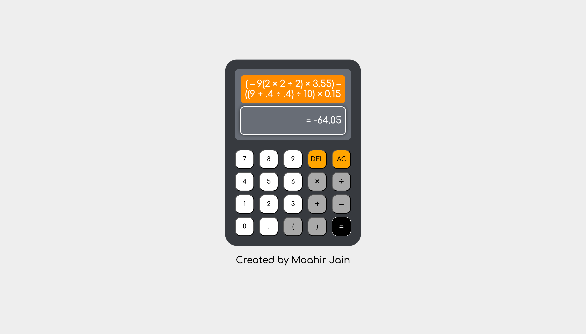

# Calculator

A web calculator I built that supports parentheses, decimals, and follows the [order of operations](https://en.wikipedia.org/wiki/Order_of_operations).

## Features
- Accepts inputs up to 200 characters
- Allows the user to use the computed answer for further calculations.
- Includes both keyboard and button support
- Provides visual feedback for ambiguous or undefined computations
- Restricts the input of undefined expressions
- Supports parentheses, decimals, integers, and the basic arithmetic operators, and follows the order of operations
- Supports backspace and clearing of the input
- Provides visual feedback for various interactions
- Responds to all kinds of devices
- Rounds answers to two decimal places
- Does NOT use JavaScript [eval()](https://developer.mozilla.org/en-US/docs/Web/JavaScript/Reference/Global_Objects/eval)!

## Keyboard and Button Options
- Press <kbd>esc</kbd> or click `AC` to clear input.
- Press <kbd>A</kbd> or click the computed answer to _replace_ the existing input with the computed answer.
- Press <kbd>U</kbd> to _use_ the computed answer in the existing input expression.
- Press <kbd>delete</kbd>, <kbd>Backspace</kbd> or click `DEL` to delete the last entered character.
- Press <kbd>return</kbd>, <kbd>Enter</kbd> or click `=` to evaluate the input expression.
- Press <kbd>*</kbd> or click `×` to input the multiplication operator.
- Press <kbd>/</kbd> or click `÷` to input the division operator.
- Press <kbd>+</kbd>, <kbd>-</kbd>, <kbd>(</kbd>, <kbd>)</kbd>, <kbd>.</kbd>, <kbd>0</kbd>, <kbd>1</kbd>, <kbd>2</kbd>, <kbd>3</kbd>, <kbd>4</kbd>, <kbd>5</kbd>, <kbd>6</kbd>, <kbd>7</kbd>, <kbd>8</kbd>, <kbd>9</kbd> or click the corresponding buttons to input them into the current expression.

